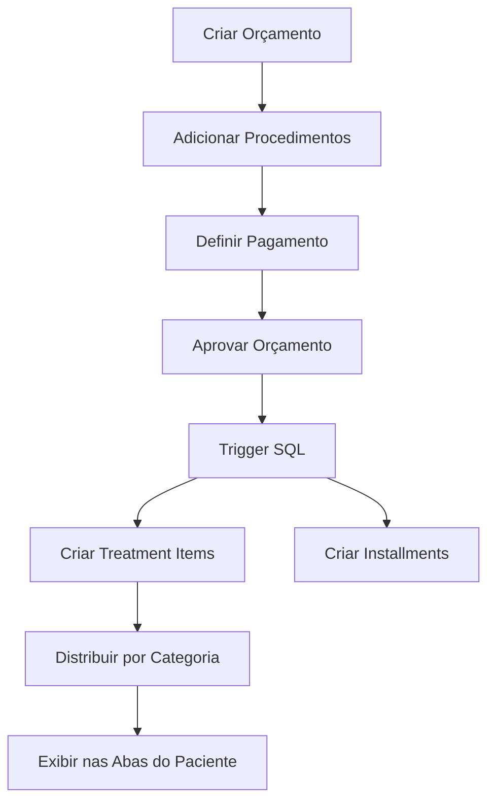

# 🏥 ClinicPro - Sistema de Gestão Clínica Completo

[](https://pages.cloudflare.com)
[](https://supabase.com)
[](https://react.dev)

Sistema completo de gestão para clínicas odontológicas e estéticas, com foco em eficiência operacional, controle financeiro e experiência do paciente.

## ✨ Funcionalidades Principais

### 📋 Gestão de Pacientes
- Cadastro completo com fotos e documentos
- Perfil detalhado com abas organizadas
- Histórico clínico e financeiro
- Galeria de imagens (antes/depois)
- Sistema de classificação (Diamond, Gold, Standard, Risk)

### 💰 Módulo Financeiro
- **Sistema BOS (Business Operating System)**
  - Cadastro de custos por procedimento
  - Cálculo automático de margem
  - Meta de margem mínima (30%)
  - Análise de rentabilidade
- Gestão de orçamentos
- Controle de parcelas
- Fluxo de caixa
- Relatórios financeiros

### 🦷 Gestão Clínica
- **Procedimentos Categorizados**
  - Clínica Geral
  - Ortodontia
  - HOF (Harmonização Orofacial)
- Especialidades detalhadas
- Planos de tratamento
- Prontuário eletrônico
- Agenda de consultas

### 📊 Orçamentos Inteligentes
- Criação rápida de orçamentos
- Múltiplas opções de pagamento
- Aprovação automática
- **Geração automática de:**
  - Itens de tratamento
  - Parcelas financeiras
  - Distribuição por categoria

### 🎯 Distribuição Automática de Tratamentos
Ao aprovar um orçamento, o sistema automaticamente:
1. Cria os itens de tratamento
2. Associa a categoria correta (Clínica Geral/Ortodontia/HOF)
3. Distribui nas abas do perfil do paciente
4. Gera as parcelas financeiras

### 🎮 Gamificação
- Sistema de XP e níveis
- Conquistas e recompensas
- Ranking de profissionais
- Metas e desafios

### 📈 Inteligência de Negócio
- Dashboard executivo
- KPIs em tempo real
- Insights de IA
- Análise de conversão
- Previsão de receita

## 🚀 Tecnologias

- **Frontend**: React + TypeScript + Vite
- **Backend**: Supabase (PostgreSQL)
- **Autenticação**: Supabase Auth
- **Deploy**: Cloudflare Pages
- **Estilização**: Tailwind CSS
- **Ícones**: Lucide React

## 📦 Instalação

```bash
# Clone o repositório
git clone https://github.com/Tchelovb/clinicpro_manager.git

# Entre no diretório
cd clinicpro_manager

# Instale as dependências
npm install

# Configure as variáveis de ambiente
cp .env.example .env.local
# Edite .env.local com suas credenciais do Supabase

# Execute em desenvolvimento
npm run dev
```

## 🗄️ Configuração do Banco de Dados

Execute os scripts SQL no Supabase na seguinte ordem:

1. `sql/schema.sql` - Schema principal
2. `sql/MIGRATION_CATEGORY_SPECIALTY.sql` - Categorias e especialidades
3. `sql/FIX_PROCEDURE_RLS.sql` - Políticas de segurança
4. `sql/FIX_PROCEDURE_COSTS_SAVE.sql` - Correção de custos
5. `sql/auto_budget_approval.sql` - Trigger de aprovação

## 🌐 Deploy

Consulte o arquivo [DEPLOY.md](./DEPLOY.md) para instruções detalhadas de deploy no Cloudflare Pages.

### Deploy Rápido

```bash
# Build
npm run build

# Deploy (via Cloudflare Pages conectado ao GitHub)
git push origin main
```

## 📚 Documentação

### Arquitetura do Sistema

```
ClinicPro/
├── components/          # Componentes React
│   ├── settings/       # Configurações (Procedimentos, etc)
│   ├── ui/            # Componentes de UI reutilizáveis
│   └── ...
├── pages/             # Páginas principais
├── lib/               # Utilitários e configurações
├── sql/               # Scripts SQL e migrações
└── public/            # Arquivos estáticos
```

### Fluxo de Aprovação de Orçamento



### Sistema BOS (Custos e Margem)

O sistema BOS permite cadastrar custos detalhados para cada procedimento:

- **Custo de Materiais**: Insumos utilizados
- **Custo Profissional**: Honorários do profissional
- **Custo Operacional**: Overhead da clínica

**Cálculo Automático:**
```
Margem (%) = (Preço Base - Custo Total) / Preço Base × 100
Meta BOS: ≥ 30%
```

## 🔐 Segurança

- Row Level Security (RLS) ativo em todas as tabelas
- Autenticação via Supabase Auth
- Isolamento por clínica (multi-tenant)
- HTTPS obrigatório
- Variáveis de ambiente protegidas

## 🐛 Troubleshooting

### Problema: Custos BOS não salvam
**Solução**: Execute `sql/FIX_PROCEDURE_COSTS_SAVE.sql`

### Problema: Tratamentos não aparecem nas abas
**Solução**: Execute `sql/MIGRATION_CATEGORY_SPECIALTY.sql`

### Problema: Erro de RLS ao salvar
**Solução**: Execute `sql/FIX_PROCEDURE_RLS.sql`

## 📝 Changelog

### v1.0.0 (2025-12-22)
- ✅ Sistema BOS completo
- ✅ Distribuição automática de tratamentos
- ✅ Trigger de aprovação de orçamento
- ✅ Correção de RLS
- ✅ Preparação para produção

## 🤝 Contribuindo

1. Fork o projeto
2. Crie uma branch (`git checkout -b feature/nova-funcionalidade`)
3. Commit suas mudanças (`git commit -m 'feat: Nova funcionalidade'`)
4. Push para a branch (`git push origin feature/nova-funcionalidade`)
5. Abra um Pull Request

## 📄 Licença

Este projeto é proprietário e confidencial.

## 👥 Equipe

- **Desenvolvimento**: Tchelovb
- **Suporte**: [Criar Issue](https://github.com/Tchelovb/clinicpro_manager/issues)

## 🔗 Links Úteis

- [Documentação do Supabase](https://supabase.com/docs)
- [Documentação do Cloudflare Pages](https://developers.cloudflare.com/pages/)
- [Guia de Deploy](./DEPLOY.md)

---

**Status**: ✅ Pronto para Produção  
**Versão**: 1.0.0  
**Última Atualização**: 2025-12-22
