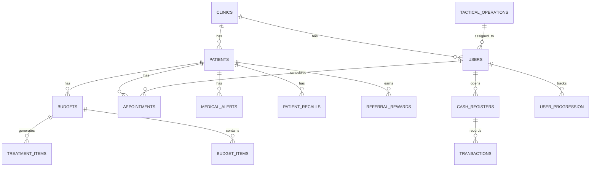

# 🏥 Clinic Pro Manager | BOS Intelligence

> **Sistema Operacional de Negócios para Clínicas de Alta Performance**

[](https://www.typescriptlang.org/)
[](https://reactjs.org/)
[](https://supabase.com/)
[](https://tailwindcss.com/)

**Versão:** 2.0 (Gamification Release) | **Status:** 🚀 Em Produção

---

## 🦅 Visão do Produto

O **Clinic Pro Manager** não é apenas um ERP para clínicas. É um **BOS (Business Operating System)** completo, projetado para transformar gestão clínica em um **simulador de crescimento executivo**.

### **Por que BOS e não apenas "Software de Gestão"?**

Enquanto ERPs tradicionais (EasyDent, SimplesDental) focam em **burocracia e compliance**, o Clinic Pro foca em:

- 💰 **Margem de Contribuição Real** (Financial Split automático)
- 💎 **Conversão High-Ticket** (Pipeline para procedimentos > R$ 10k)
- 🎮 **Gamificação de Equipe** (XP, níveis, recompensas)
- 🤖 **Inteligência Preditiva** (AI Insights, Rescue ROI)
- 📊 **Visão Executiva** (Dashboards estratégicos, não operacionais)

**Objetivo:** Elevar clínicas ao patamar de **excelência operacional** e **maximização de lucros**, transformando dados em **ações táticas automáticas**.

---

## 🧠 Arquitetura: 3 Níveis de Inteligência

O sistema opera em **três camadas integradas** que transformam dados em decisões:

### **1. 🛡️ ClinicHealth - Monitoramento Vital**

**O que é:** Painel de controle que monitora a "saúde" do negócio em tempo real.

**Como funciona:**
- **IVC (Índice de Vitalidade Corporativa):** Score de 0-100 baseado em 5 pilares
- **5 Pilares:** Marketing, Vendas, Clínico, Operacional, Financeiro
- **Alertas Automáticos:** Notifica quando um pilar cai abaixo de 70%

**Exemplo:**
```
Pilar Vendas: 65% ⚠️
↳ Taxa de conversão caiu 15% vs. mês anterior
↳ Ação Sugerida: Ativar campanha de reativação
```

**Status:** ✅ Implementado (`user_progression.health_*` fields)

---

### **2. ⚡ BOS Intelligence - Motor Tático**

**O que é:** Engine que transforma insights em **ordens de serviço automáticas**.

**Módulos:**

#### **🎯 Rescue ROI (Recuperação Automática)**
- Identifica leads/orçamentos perdidos
- Cria missões táticas para a equipe
- Rastreia taxa de recuperação

**Exemplo:**
```
🚨 Missão Tática Criada
Tipo: Rescue ROI
Alvo: Orçamento #1234 (R$ 8.500) - Perdido há 15 dias
Ação: Ligar para paciente com script de "Condição Especial"
Recompensa: +300 XP
```

#### **💎 Opportunity Radar (Classificação Inteligente)**
- Classifica leads em: DIAMOND (>R$ 10k), GOLD (R$ 5-10k), STANDARD (<R$ 5k)
- Prioriza automaticamente a fila de atendimento
- Sugere abordagem personalizada

#### **📈 Ticket Expansion (Upsell Automático)**
- Identifica pacientes de Odonto com perfil para HOF (Harmonização Orofacial)
- Sugere procedimentos complementares
- Calcula potencial de receita adicional

**Status:** 🟡 Parcial (`tactical_operations`, `ai_insights` - falta engine de geração)

---

### **3. 🎮 Executive Mastery - Gamificação Estratégica**

**O que é:** Sistema de progressão que transforma gestão em jogo.

**Mecânicas:**

#### **XP System (Experiência)**
Ações geram XP baseado em impacto financeiro:

| Ação | Role | XP | Impacto |
|------|------|-----|---------|
| **Venda Diamond** (>R$ 10k) | CRC | +500 | Faturamento High-Ticket |
| **Venda Gold** (R$ 5-10k) | CRC | +250 | Conversão de Avaliação |
| **Recovery** (Resgate) | CRC | +300 | Recuperação de Lead Perdido |
| **Review 5★** | PROFESSIONAL | +200 | NPS / Reputação |
| **Agenda Cheia** (100% ocupação) | RECEPTIONIST | +150 | Eficiência Operacional |
| **Caixa Fechado Sem Divergência** | RECEPTIONIST | +100 | Disciplina Financeira |

#### **Níveis (4 Tiers)**
1. **Nível 1:** Gestor de Fluxo (0-999 XP)
2. **Nível 2:** Estrategista Tático (1.000-4.999 XP)
3. **Nível 3:** Arquiteto de Crescimento (5.000-14.999 XP)
4. **Nível 4:** Lenda do Instituto (15.000+ XP)

#### **Recompensas Reais**
- Catálogo de recompensas resgatáveis com XP
- Bonificações financeiras baseadas em performance auditada
- Reconhecimento público (leaderboard)

**Status:** ✅ Implementado (`user_progression`, `achievements`, `reward_catalog`)

---

## 💎 Funcionalidades Core (High-Ticket Focus)

### **💰 Financeiro "CFO Digital"**

#### **Fort Knox (Caixa Obrigatório)**
- Sistema bloqueia acesso sem abertura de caixa
- Sangria e Suprimento rastreados
- Auditoria completa de movimentações

#### **Financial Split Automático** 🚧
- Separação automática de repasses (Anestesista, Hospital, Parceiros)
- Cálculo de lucro líquido real
- Visão clara de margem de contribuição

**Exemplo:**
```
Venda: R$ 15.000 (Cervicoplastia)
├─ Repasse Hospital: R$ 3.000 (20%)
├─ Repasse Anestesista: R$ 1.500 (10%)
├─ Custo Materiais: R$ 2.000
├─ Comissão Profissional: R$ 4.500 (30%)
└─ Lucro Líquido: R$ 4.000 (26,7%)
```

**Status:** 🟡 Parcial (caixa ✅, split automático 🚧)

#### **Gestão de Taxas de Cartão**
- Cálculo automático do custo financeiro de parcelamentos
- Comparação de taxas por operadora
- Sugestão de melhor forma de pagamento

**Status:** 🚧 Planejado

---

### **🎯 CRM & Pipeline High-Ticket**

#### **Dossiê do Cliente (High-Ticket CRM)**
- **Perfil Social:** Instagram, profissão, nickname, notas VIP
- **Classificação ABC:** DIAMOND, GOLD, STANDARD, RISK, BLACKLIST (automática)
- **Galeria de Fotos:** 6 tipos (perfil, sorriso, frontal, lateral, documentos)
- **Responsável Financeiro:** Rastreamento de guarantor (pagador)
- **Programa de Indicações:** Recompensas automáticas (R$ 50 quando indicado paga R$ 500+)

**Status:** ✅ Implementado

#### **Funil High-Ticket**
- Pipeline exclusivo para procedimentos > R$ 10k
- Scripts de vendas personalizados
- Régua de follow-up automática

**Status:** 🟡 Parcial (pipeline ✅, régua automática 🚧)

#### **Alertas Médicos Críticos**
- Popup bloqueante vermelho para alergias/contraindicações
- Exige confirmação de ciência antes de prosseguir
- Histórico de alertas visualizados

**Status:** ✅ Implementado

---

### **🦷 Clínico & Operacional**

#### **Prontuário Visual**
- Odontograma interativo
- Face Mapping para planejamento cirúrgico
- Evolução clínica com fotos before/after

**Status:** 🟡 Parcial (evolução ✅, odontograma 🚧)

#### **Lab Tracking (Rastreabilidade Protética)**
- Rastreamento completo de próteses e casos laboratoriais
- 8 status: Preparando → Enviado → Em Progresso → Pronto → Recebido → Entregue
- Controle de qualidade e devoluções
- Histórico de correções

**Status:** ✅ Implementado

#### **Smart Agenda**
- Confirmações automáticas (24h e 2h antes)
- Bloqueios estratégicos
- Redução de no-show

**Status:** 🟡 Parcial (agenda ✅, confirmações automáticas 🚧)

---

### **📞 Recalls Estruturados (Retenção)**

**10 Tipos de Recall:**
- Profilaxia (6 meses)
- Botox Renewal (4-6 meses)
- Filler Renewal (8-12 meses)
- Manutenção de Implantes
- Controle Ortodôntico
- E mais...

**Funcionalidades:**
- Dashboard com filtros (Pendentes, Atrasados, Para Hoje)
- Priorização automática
- Registro de tentativas de contato
- Mensagens sugeridas personalizadas

**Status:** ✅ Implementado (envio automático 🚧)

---

## 🛠️ Stack Tecnológica

### **Frontend**
- **React 18** - Biblioteca UI moderna
- **TypeScript** - Tipagem estática para segurança
- **Vite** - Build tool ultra-rápido
- **Tailwind CSS** - Framework CSS utility-first
- **React Router v6** - Roteamento SPA
- **Lucide React** - Ícones modernos e consistentes
- **React Hot Toast** - Notificações elegantes
- **Recharts** - Visualização de dados
- **jsPDF + XLSX** - Exportação de documentos

### **Backend & Database**
- **Supabase** - Backend-as-a-Service completo
  - **PostgreSQL 15** - Banco de dados relacional robusto
  - **Row Level Security (RLS)** - Segurança a nível de linha
  - **Realtime Subscriptions** - Atualizações em tempo real
  - **Storage** - Armazenamento de fotos e documentos
  - **Edge Functions** - Lógica serverless
  - **Authentication** - Sistema de autenticação completo

### **Integrações**
- **WhatsApp API** (Evolution API) - Notificações e confirmações 🚧
- **Supabase Storage** - Upload de imagens ✅
- **Webhooks** - Integrações externas 🚧

---

## 📂 Estrutura de Roles (Personas)

O sistema adapta a interface baseada em **5 personas fundamentais**:

### **1. 👑 MASTER (Holding/Multi-Clínica)**
- Visão consolidada de todas as clínicas
- Dashboard executivo com KPIs agregados
- Controle de status de clínicas (Ativa/Suspensa)
- Acesso total ao sistema

### **2. 👨‍💼 ADMIN (Gestor da Clínica)**
- Acesso total à sua clínica
- War Room (Centro de Inteligência)
- DRE Gerencial
- Configurações de gamificação
- Gestão de usuários e permissões

### **3. 🛡️ PROFESSIONAL (Dentistas/Médicos)**
- Agenda pessoal
- Prontuário eletrônico
- Minha Produção (métricas individuais)
- Prescrições e atestados
- **SEM acesso ao financeiro global**

### **4. 🗣️ CRC (Consultora de Relacionamento com Cliente)**
- Pipeline de vendas
- Radar de Oportunidades (DIAMOND, GOLD, STANDARD)
- Scripts de vendas
- Follow-up e régua de cobrança
- Dashboard de conversão

### **5. 👩‍💼 RECEPTIONIST (Secretária/Recepção)**
- Agenda geral
- Confirmação de consultas
- Cadastro de pacientes
- Caixa diário (Fort Knox)
- Controle de no-show

---

## 📊 Estrutura do Banco de Dados

### **Módulos Principais**

```
📦 CLINIC PRO DATABASE (68 Tabelas)
│
├── 🏥 CORE
│   ├── clinics (multi-tenancy)
│   ├── users (autenticação)
│   ├── professionals (profissionais)
│   └── user_permissions (controle granular)
│
├── 💎 PACIENTES (HIGH-TICKET CRM)
│   ├── patients (dados + dossiê high-ticket)
│   ├── medical_alerts (alertas críticos)
│   ├── patient_anamnesis (anamnese)
│   ├── dental_charting (odontograma)
│   ├── clinical_images (galeria)
│   └── patient_recalls (recalls estruturados)
│
├── 💰 FINANCEIRO (FORT KNOX)
│   ├── cash_registers (caixas)
│   ├── transactions (movimentações)
│   ├── financial_installments (parcelas)
│   ├── payment_history (histórico)
│   └── expenses (despesas)
│
├── 📅 AGENDA
│   ├── appointments
│   └── appointment_confirmations (automação)
│
├── 💼 ORÇAMENTOS & TRATAMENTOS
│   ├── budgets
│   ├── budget_items
│   ├── treatment_items (plano de tratamento)
│   └── procedure (procedimentos)
│
├── 🔬 CLÍNICO
│   ├── clinical_notes (evolução)
│   ├── prescriptions → prescription_items
│   ├── medical_certificates (atestados)
│   └── clinical_form_responses (formulários)
│
├── 🧪 LABORATÓRIO
│   └── lab_orders (rastreamento protético)
│
├── 📦 ESTOQUE
│   ├── inventory_items
│   ├── inventory_movements
│   └── procedure_recipes (receitas de materiais)
│
├── 📞 CRM
│   ├── leads
│   ├── lead_interactions
│   └── lead_tasks
│
├── 🎁 INDICAÇÕES
│   └── referral_rewards (recompensas automáticas)
│
└── 🎮 GAMIFICAÇÃO
    ├── user_progression (XP, níveis, health score)
    ├── achievements (conquistas)
    ├── tactical_operations (missões)
    └── reward_catalog (loja de recompensas)
```

### **Diagrama ER Simplificado**



---

## 🚀 Instalação e Configuração

### **Pré-requisitos**
- Node.js 18+ e npm
- Conta no Supabase
- Git

### **1. Clone o Repositório**
```bash
git clone https://github.com/seu-usuario/clinic-pro-manager.git
cd clinic-pro-manager
```

### **2. Instale as Dependências**
```bash
npm install
```

### **3. Configure as Variáveis de Ambiente**
Crie um arquivo `.env` na raiz do projeto:

```env
VITE_SUPABASE_URL=https://seu-projeto.supabase.co
VITE_SUPABASE_ANON_KEY=sua-chave-anonima
```

### **4. Execute as Migrations do Banco**
No Supabase SQL Editor, execute na ordem:

1. `sql/migrations/001_appointment_confirmations.sql`
2. `sql/migrations/002_lab_orders.sql`
3. `sql/migrations/003_patient_recalls.sql`
4. `sql/migrations/004_ALL_P1_P2_MODULES.sql`
5. `sql/migrations/005_inventory_base.sql`
6. `sql/migrations/006_patients_high_ticket.sql`
7. `sql/migrations/007_referral_rewards.sql`

### **5. Inicie o Servidor de Desenvolvimento**
```bash
npm run dev
```

Acesse: `http://localhost:5173`

---

## 📁 Estrutura de Pastas

```
ClinicPro/
├── components/          # Componentes React
│   ├── patient/        # Dossiê High-Ticket
│   ├── recalls/        # Sistema de recalls
│   ├── referrals/      # Programa de indicações
│   ├── confirmations/  # Confirmações automáticas
│   └── lab/            # Laboratório
├── contexts/           # Context API (Auth, Data)
├── services/           # Camada de serviços (API calls)
├── types/              # TypeScript types
├── utils/              # Funções utilitárias
├── sql/
│   ├── migrations/     # Migrations SQL
│   └── schema.sql      # Schema completo
├── docs/               # Documentação
│   ├── STATUS_EXECUTIVO.md
│   ├── ANALISE_CONSISTENCIA.md
│   └── GUIA_TESTES_HIGH_TICKET.md
└── public/             # Assets estáticos
```

---

## 🗺️ Roadmap

### **✅ Fase 1 - MVP Core (Concluído - Q4 2024)**
- [x] Autenticação e multi-tenancy
- [x] Gestão de pacientes
- [x] Agenda
- [x] Orçamentos
- [x] Financeiro básico
- [x] Fort Knox (caixa obrigatório)

### **✅ Fase 2 - Módulos P0 (Concluído - Q1 2025)**
- [x] Confirmações automáticas (estrutura)
- [x] Laboratório protético
- [x] Recalls estruturados
- [x] Programa de indicações
- [x] CRM High-Ticket (Dossiê Social)
- [x] Gamificação (XP, níveis, conquistas)

### **🚧 Fase 3 - Automação e Inteligência (Em Andamento - Q1 2025)**
- [ ] Integração WhatsApp/SMS (Evolution API)
- [ ] Notificações automáticas (recalls, confirmações)
- [ ] Cálculo automático de comissões
- [ ] AI Insights Engine (geração de insights)
- [ ] Dashboards executivos (War Room)
- [ ] Financial Split automático

### **📅 Fase 4 - Expansão (Planejado - Q2-Q3 2025)**
- [ ] Assinatura digital (contratos, anamnese)
- [ ] Telemedicina (consultas online)
- [ ] App mobile para pacientes
- [ ] Multi-idioma (i18n)
- [ ] Marketplace de integrações
- [ ] Módulo de estoque inteligente
- [ ] Previsão de demanda (AI)

---

## 🧪 Testes e Validação

### **Executar Testes de Validação**
```bash
# No Supabase SQL Editor, execute:
sql/migrations/TESTS_VALIDATION.sql
```

Isso criará:
- Pacientes de teste (Maria Indicadora, João Indicado)
- Alerta médico crítico
- Recompensa automática de R$ 50

### **Testar no Frontend**
1. Acesse `/patients` e abra um paciente
2. Vá na aba "Cadastro" → Veja o **Dossiê High-Ticket**
3. Se houver alerta crítico, verá o **Popup Vermelho Bloqueante**
4. Acesse `/dashboard/recalls` → Veja recalls pendentes
5. Acesse `/dashboard/indicacoes` → Veja leaderboard
6. Acesse `/dashboard/laboratorio` → Veja pedidos protéticos

---

## 📊 Métricas do Sistema

### **Cobertura de Funcionalidades**
- **Total de Tabelas:** 68
- **Tabelas com Lógica Completa:** 45 (66%)
- **Tabelas com Lógica Parcial:** 15 (22%)
- **Tabelas Planejadas:** 8 (12%)

### **Linhas de Código**
- **TypeScript/TSX:** ~25.000 linhas
- **SQL (Migrations):** ~8.000 linhas
- **Componentes React:** 85 arquivos
- **Services:** 12 arquivos

### **Score de Saúde do Projeto**
- **Arquitetura:** 95% 🟢
- **Frontend:** 90% 🟢
- **Backend:** 75% 🟡
- **Segurança:** 70% 🟡
- **Performance:** 65% 🟡
- **Automação:** 30% 🔴

**Score Global:** **75/100** - **BOM, com melhorias críticas necessárias**

---

## 🤝 Contribuindo

1. Fork o projeto
2. Crie uma branch para sua feature (`git checkout -b feature/AmazingFeature`)
3. Commit suas mudanças (`git commit -m 'Add some AmazingFeature'`)
4. Push para a branch (`git push origin feature/AmazingFeature`)
5. Abra um Pull Request

---

## 📄 Licença

**Propriedade Intelectual Privada.**  
Este software é proprietário e confidencial. O uso, cópia ou distribuição não autorizada é estritamente proibida.

---

## 👨‍💻 Créditos

**Desenvolvido para clínicas de alta performance que buscam excelência operacional.**

---

## 🎯 Filosofia do Produto

> *"O BOS não é um assistente. É um sócio estrategista que nunca dorme, nunca esquece e sempre prioriza o crescimento exponencial."*

O Clinic Pro Manager foi projetado com uma filosofia clara:

1. **Dados sem ação são desperdício** → Transformamos dados em ordens de serviço táticas
2. **Gestão deve ser recompensadora** → Gamificação transforma trabalho em jogo
3. **High-Ticket exige CRM diferenciado** → Dossiê social, não apenas cadastro
4. **Margem importa mais que faturamento** → Financial Split mostra lucro real
5. **Automação libera tempo para estratégia** → Recalls, confirmações e insights automáticos

---

**Feito com ❤️ para revolucionar a gestão de clínicas de alta performance**
