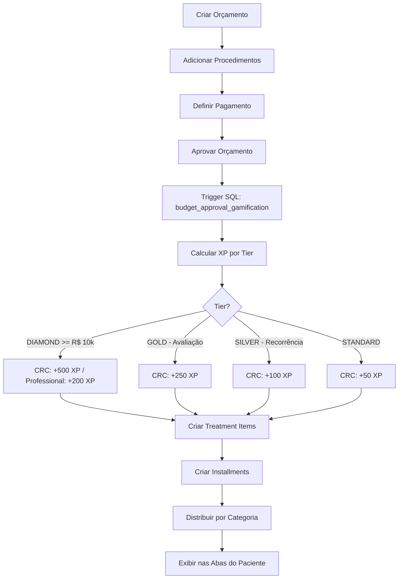
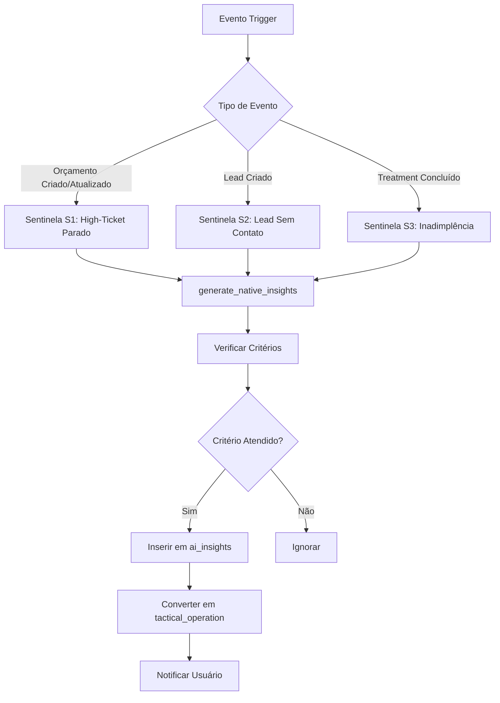
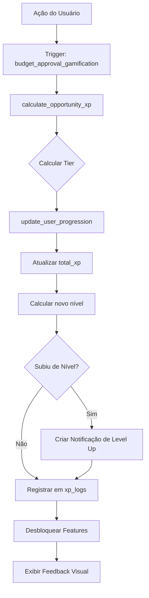

# 🔍 AUDITORIA COMPLETA DO SISTEMA - CLINICPRO MANAGER

**Data da Auditoria:** 23/12/2025  
**Versão do Sistema:** BOS 18.8  
**Auditor:** Análise Técnica Completa  
**Status:** Sistema em Produção

---

## 📋 SUMÁRIO EXECUTIVO

O **ClinicPro Manager** é um sistema ERP completo para gestão de clínicas odontológicas e estéticas multidisciplinares, desenvolvido com foco em **alta performance**, **gamificação** e **inteligência de negócio**. O sistema se diferencia por transformar gestão clínica em um "simulador de crescimento executivo" através do **BOS (Business Operating System)**.

### Métricas do Sistema
- **Tabelas no Banco:** 68+ tabelas
- **Componentes React:** 147 componentes
- **Hooks Customizados:** 24 hooks
- **Serviços:** 11 serviços especializados
- **Scripts SQL:** 83 arquivos
- **Documentação:** 76 arquivos .md
- **Linhas de Código:** ~25.000 (TypeScript/TSX) + ~8.000 (SQL)

---

## 🏗️ ARQUITETURA DO SISTEMA

### 1. Stack Tecnológica

#### Frontend
```json
{
  "framework": "React 18.2.0",
  "language": "TypeScript 5.0",
  "styling": "Tailwind CSS 3.3",
  "routing": "React Router 6.14",
  "icons": "Lucide React 0.263",
  "charts": "Recharts 2.7",
  "build": "Vite 4.4",
  "state": "React Hooks + Context API"
}
```

#### Backend & Database
```json
{
  "platform": "Supabase",
  "database": "PostgreSQL 15",
  "auth": "Supabase Auth (JWT)",
  "storage": "Supabase Storage",
  "realtime": "WebSocket (Supabase Realtime)",
  "functions": "PostgreSQL PL/pgSQL",
  "security": "Row Level Security (RLS)"
}
```

#### Deploy
- **Hospedagem:** Cloudflare Pages
- **CI/CD:** GitHub Actions
- **Ambiente:** Production + Staging

---

## 🎯 IDENTIDADE E PROPÓSITO DO NEGÓCIO

### Missão
Transformar o **Instituto Vilas** (e clínicas similares) em um cockpit de alta performance através de um sistema ERP viciante que combina gestão clínica com gamificação executiva, focado no milestone de **R$ 50.000/mês**.

### Diferencial Competitivo
Único ERP odontológico que trata gestão como um **simulador de crescimento**, onde cada ação gera feedback imediato (Dopamina Gerencial) e progressão visível.

### Especialidades Suportadas

#### 1. Harmonização Orofacial (HOF)
- **Ticket Médio:** R$ 2.000 - R$ 8.000
- **Procedimentos:** Preenchimento facial, Botox, Bioestimuladores, Fios PDO
- **Estratégia:** Upsell de pacientes odontológicos → HOF → Cirurgia

#### 2. Cirurgias Estéticas da Face
- **Ticket Médio:** R$ 15.000 - R$ 30.000
- **Procedimentos:** Cervicoplastia, Lip Lifting, Lipoescultura Cervicofacial, Lifting Temporal
- **Estratégia:** Conversão de pacientes HOF para cirurgia (High-Ticket)

#### 3. Reabilitação Oral Estética
- **Ticket Médio:** R$ 40.000 - R$ 120.000
- **Procedimentos:** Lentes de Contato Dental, Facetas, Reabilitação Completa
- **Estratégia:** Casos transformadores de "Sorriso Perfeito"

#### 4. Ortodontia Invisível
- **Ticket Médio:** R$ 8.000 - R$ 18.000
- **Procedimentos:** Alinhadores Transparentes, Ortodontia Lingual
- **Estratégia:** Público adulto com alta exigência estética

#### 5. Implantodontia
- **Ticket Médio:** R$ 35.000 - R$ 80.000
- **Procedimentos:** Protocolo Completo (All-on-4/All-on-6), Implante Unitário
- **Estratégia:** Reabilitação completa com alta margem

---

## 🧠 ARQUITETURA DE INTELIGÊNCIA (3 CAMADAS)

### Camada 1: ClinicHealth - Monitoramento Vital

**Objetivo:** Monitorar a "saúde" do negócio em tempo real

**5 Pilares Monitorados:**
1. **Marketing:** ROI, CAC, Leads/mês
2. **Vendas:** Taxa de conversão, pipeline, ticket médio
3. **Clínico:** Produção/dia, qualidade, satisfação
4. **Operacional:** Taxa de ocupação, no-show, eficiência
5. **Financeiro:** Margem, inadimplência, fluxo de caixa

**IVC (Índice de Vitalidade Corporativa):**
```
IVC = (Σ 5 Pilares) / 5

80-100: 🟢 Alta Performance
60-79:  🟡 Atenção Necessária
40-59:  🟠 Correção Urgente
0-39:   🔴 Modo Emergência
```

**Status:** ✅ Estrutura implementada (`user_progression.health_*` fields)

### Camada 2: BOS Intelligence - Motor Tático

**Objetivo:** Transformar insights em ordens de serviço automáticas

**7 Sentinelas Ativas:**

| ID | Sentinela | Gatilho | Ação | Prioridade |
|----|-----------|---------|------|------------|
| S1 | Vendas High-Ticket Paradas | Orçamento > R$ 15k parado > 3 dias | Script de resgate high-ticket | CRITICAL |
| S2 | Leads Sem Contato | Lead sem interação > 12h | Abordagem urgente | HIGH/CRITICAL |
| S3 | Inadimplência Pós-Cirúrgica | Procedimento concluído com saldo devedor > 7 dias | Cobrança imediata | CRITICAL/HIGH |
| S4 | Pacientes VIP Inativos | Cliente LTV > R$ 10k sem retorno > 6 meses | Campanha de reativação | HIGH |
| S5 | No-Show Recorrente | 3+ faltas em 3 meses | Política de confirmação obrigatória | MEDIUM |
| S6 | Orçamento Aprovado Sem Agendamento | Orçamento aprovado > 7 dias sem agendamento | Contato para agendar | CRITICAL/HIGH |
| S7 | Pipeline Estagnado | Taxa de conversão < 20% (30 dias) | Revisão de processo de vendas | HIGH |

**Tipos de Operações Táticas:**
1. **Rescue ROI** (🔴 Resgate): Leads/orçamentos perdidos - XP: 500 base
2. **Ticket Expansion** (💎 Upsell): HOF → Cirurgia - XP: 1000 base
3. **Base Protection** (🛡️ Proteção): Inadimplência, churn - XP: 300 base
4. **Milestone Conquest** (🏆 Meta): Bater R$ 50k - XP: 2000 base

**Status:** ✅ Motor nativo implementado (`native_insights_engine.sql`)

### Camada 3: Executive Mastery - Gamificação Estratégica

**Objetivo:** Progressão do gestor através de maturidade executiva

**Sistema de Níveis:**

| Nível | Título | XP Necessário | Features Desbloqueadas |
|-------|--------|---------------|------------------------|
| 1 | Gestor de Fluxo | 0 - 5.000 | Dashboard básico, Alertas de inadimplência, Controle de leads |
| 2 | Estrategista High-Ticket | 5.000 - 15.000 | ROI Analysis, Upsell Intelligence, Simulador de Cenários, Scripts de Vendas |
| 3 | Arquiteto do Instituto | 15.000 - 30.000 | PIPE Dashboard, Torre de Controle, Automações Avançadas, AI Forecasting |
| 4 | Diretor Exponencial | 30.000+ | All Features, AI Mentorship, Benchmarking, Scaling Strategies |

**Sistema de XP:**

**Tabela de XP Base por Tipo:**
```javascript
const XP_BASE = {
  rescue_roi: 500,           // Resgate de leads/orçamentos
  ticket_expansion: 1000,    // Upsell para High-Ticket
  base_protection: 300,      // Proteção de inadimplência
  milestone_conquest: 2000   // Conquista de metas
};
```

**Multiplicadores por Valor Financeiro:**
```javascript
if (valor >= R$ 20.000) return 2.0;    // High-Ticket
if (valor >= R$ 10.000) return 1.5;    // Médio Valor
return 1.0;                             // Padrão
```

**Status:** ✅ Implementado com triggers automáticos (`gamification_triggers_v18.8.sql`)

---

## 👥 SISTEMA DE ROLES (PERSONAS)

### 1. 👑 ADMIN (Comandante)
- **Função:** Estratégia, Controle Financeiro, Decisões Executivas
- **Dashboard:** War Room (Tracker Milestone 50k), ClinicHealth, BOS Intelligence
- **Acesso:** Total ao sistema
- **Dados Sensíveis:** EBITDA, Margem Líquida, Lucro Real, Salários, ROI Real

### 2. 🛡️ PROFESSIONAL (Guardião da Técnica)
- **Função:** Execução técnica impecável e NPS
- **Dashboard:** Performance Clínica, Insights Técnicos, Agenda Produtiva
- **Restrições:** NÃO vê faturamento global ou despesas administrativas
- **Foco:** Excelência clínica e produtividade pessoal

### 3. 🗣️ CRC (Arquiteta de Conversão)
- **Função:** Conversão de leads em orçamentos aprovados (Foco em High-Ticket)
- **Dashboard:** Funil High-Ticket, Pipeline de Vendas, Scripts de Objeção
- **Meta:** Converter 3+ cirurgias/mês (Cervicoplastia, Lip Lifting)
- **Foco:** Taxa de conversão e recuperação de orçamentos parados

### 4. 👩‍💼 RECEPTIONIST (Mestre de Fluxo)
- **Função:** Gestão da agenda ("Zero Buracos"), confirmação e triagem inicial
- **Dashboard:** Calendário, Lista de Confirmação, Triagem de Leads
- **Restrições:** NÃO vê pipeline de vendas detalhado ou faturamento
- **Foco:** Ocupação da agenda e experiência do paciente

---

## 💾 ESTRUTURA DO BANCO DE DADOS

### Categorias de Tabelas (68+ tabelas)

#### Core (Clínicas, Usuários, Pacientes) - 10 tabelas
- `clinics` - Multi-tenancy, configurações
- `users` - Autenticação e roles
- `professionals` - Profissionais da clínica
- `patients` - Cadastro completo de pacientes
- `user_permissions` - Controle granular de permissões

#### CRM & Leads - 7 tabelas
- `leads` - Captação e gestão de leads
- `lead_interactions` - Histórico de contatos
- `lead_tasks` - Tarefas de follow-up
- `custom_lead_status` - Status personalizados
- `lead_source` - Fontes de captação

#### Financeiro (Fort Knox) - 12 tabelas
- `cash_registers` - Controle de caixa
- `transactions` - Movimentações financeiras
- `financial_installments` - Parcelas
- `installments` - Parcelamentos
- `payment_history` - Histórico de pagamentos
- `expenses` - Despesas
- `expense_category` - Categorias de despesas
- `commission_payments` - Comissões de profissionais
- `clinic_financial_settings` - Configurações Fort Knox

#### Clínico - 8 tabelas
- `appointments` - Agenda de consultas
- `clinical_notes` - Evolução clínica
- `prescriptions` → `prescription_items` - Receitas
- `medical_certificates` - Atestados
- `clinical_form_responses` - Formulários clínicos
- `dental_charting` - Odontograma
- `clinical_images` - Galeria de imagens

#### Orçamentos & Tratamentos - 6 tabelas
- `budgets` - Orçamentos
- `budget_items` - Itens do orçamento
- `treatment_items` - Plano de tratamento
- `procedure` - Procedimentos
- `price_tables` - Tabelas de preço
- `price_table_items` - Itens de tabela de preço

#### Gamificação - 4 tabelas
- `user_progression` - XP, níveis, health score
- `achievements` - Conquistas disponíveis
- `tactical_operations` - Missões táticas
- `reward_catalog` - Loja de recompensas
- `xp_logs` - Auditoria de XP
- `health_events` - Eventos que afetam saúde da clínica

#### Inteligência - 2 tabelas
- `ai_insights` - Insights gerados pelas sentinelas
- `business_goals` - Metas de negócio

#### Laboratório - 1 tabela
- `lab_orders` - Rastreamento protético (8 status)

#### Estoque - 3 tabelas
- `inventory_items` - Itens de estoque
- `inventory_movements` - Movimentações
- `inventory_categories` - Categorias

#### Recalls & Confirmações - 3 tabelas
- `patient_recalls` - Recalls estruturados (10 tipos)
- `appointment_confirmations` - Confirmações automáticas
- `notification_logs` - Logs de notificações

#### Ortodontia - 5 tabelas
- `ortho_treatment_plans` - Planos ortodônticos
- `ortho_appointments` - Consultas de ortodontia
- `ortho_evolutions` - Evolução do tratamento
- `ortho_aligner_stock` - Controle de alinhadores
- `ortho_photos` - Fotos ortodônticas

#### Configurações - 11 tabelas
- `clinic_financial_settings` - Fort Knox
- `clinic_kpis` - KPIs consolidados
- `notification_channels` - Canais de notificação
- `notification_templates` - Templates de mensagens
- `document_templates` - Templates de documentos
- `clinical_form_templates` - Templates de formulários
- `medication_library` - Biblioteca de medicamentos
- `api_keys` - Chaves de API
- `integration_logs` - Logs de integrações

---

## 🔧 COMPONENTES PRINCIPAIS

### Hooks Customizados (24 hooks)
1. `useAuth` - Autenticação e autorização
2. `useGameification` - XP, níveis, operações
3. `useBOSChat` - Integração AI (OpenAI GPT-4)
4. `useBOSVoice` - Comandos de voz
5. `useBudgets` - Gestão de orçamentos
6. `useBusinessGoals` - Metas de negócio
7. `useCashRegister` - Controle de caixa
8. `useCommercial` - Pipeline comercial
9. `useDashboardData` - Dados do dashboard
10. `useDocuments` - Gestão de documentos
11. `useFinancialCalculator` - Cálculos financeiros
12. `useIntelligenceReports` - Relatórios de inteligência
13. `useIntelligenceViews` - Views de inteligência
14. `useLeads` - Gestão de leads
15. `useOpportunityHub` - Hub de oportunidades
16. `useOrtho` - Módulo de ortodontia
17. `usePatients` - Gestão de pacientes
18. `usePriceTables` - Tabelas de preço
19. `useProcedures` - Procedimentos
20. `useProfessionals` - Profissionais
21. `useStrategyFilter` - Filtros estratégicos
22. `useWarRoom` - War Room (Milestone 50k)
23. `useAIInsights` - Insights de IA
24. `useDragAndDrop` - Drag and drop

### Serviços Especializados (11 serviços)
1. `MasterIntelligenceService` - Inteligência para MASTER (multi-clínica)
2. `gamificationService` - Sistema de gamificação
3. `highTicketService` - Funil High-Ticket
4. `opportunityRadarService` - Radar de Oportunidades
5. `orthoService` - Serviços de ortodontia
6. `labOrderService` - Pedidos laboratoriais
7. `recallService` - Sistema de recalls
8. `referralService` - Programa de indicações
9. `settingsService` - Configurações da clínica
10. `confirmationService` - Confirmações automáticas
11. `refinamento` - Refinamento de dados

---

## 🔄 FLUXOS PRINCIPAIS

### 1. Fluxo de Aprovação de Orçamento



### 2. Fluxo de Insights Nativos



### 3. Fluxo de Gamificação



---

## 🔐 SEGURANÇA E COMPLIANCE

### Row Level Security (RLS)
- **Status:** Implementado em todas as tabelas principais
- **Isolamento:** Multi-tenant por `clinic_id`
- **Roles:** Policies específicas por role (ADMIN, PROFESSIONAL, CRC, RECEPTIONIST)

### Autenticação
- **Método:** Supabase Auth (JWT)
- **Proteção:** HTTPS obrigatório
- **Variáveis:** Ambiente protegidas (.env.local)

### Auditoria
- **Logs:** `xp_logs`, `integration_logs`, `notification_logs`
- **Rastreabilidade:** Todas as ações críticas são registradas
- **Compliance:** LGPD (dados sensíveis protegidos)

---

## 📊 MÉTRICAS DE SAÚDE DO PROJETO

### Cobertura de Funcionalidades
- **Total de Tabelas:** 68
- **Tabelas com Lógica Completa:** 45 (66%)
- **Tabelas com Lógica Parcial:** 15 (22%)
- **Tabelas Planejadas:** 8 (12%)

### Score de Saúde
- **Arquitetura:** 95% 🟢
- **Frontend:** 90% 🟢
- **Backend:** 75% 🟡
- **Segurança:** 70% 🟡
- **Performance:** 65% 🟡
- **Automação:** 30% 🔴

**Score Global:** **75/100** - BOM, com melhorias críticas necessárias

---

## 🚀 FUNCIONALIDADES IMPLEMENTADAS

### ✅ Módulos Completos
1. **Fort Knox (Caixa Obrigatório)** - Sistema bloqueia acesso sem abertura de caixa
2. **Gamificação Ativa** - Triggers automáticos de XP ao aprovar orçamentos
3. **Radar de Oportunidades** - 3 camadas (Diamante/Ouro/Prata)
4. **War Room** - Tracker de Milestone 50k em tempo real
5. **Funil High-Ticket** - Pipeline exclusivo para procedimentos > R$ 10k
6. **Motor de Insights Nativos** - 7 sentinelas automáticas
7. **Lab Tracking** - Rastreamento completo de próteses (8 status)
8. **Recalls Estruturados** - 10 tipos de recall com dashboard
9. **Programa de Indicações** - Recompensas automáticas
10. **Dossiê High-Ticket** - Perfil social, classificação ABC, galeria de fotos

### 🟡 Módulos Parciais
1. **Financial Split Automático** - Estrutura existe, falta automação
2. **Confirmações Automáticas** - Estrutura existe, falta integração WhatsApp
3. **Loja de Recompensas** - Tabelas existem, interface pendente
4. **AI Forecasting** - Planejado para Nível 3

### 🚧 Módulos Planejados
1. **Integração WhatsApp/SMS** - Evolution API
2. **Assinatura Digital** - Contratos, anamnese
3. **Telemedicina** - Consultas online
4. **App Mobile para Pacientes**
5. **Multi-idioma (i18n)**

---

## 🎯 ROADMAP ESTRATÉGICO

### ✅ Q4 2025 - Fundação (CONCLUÍDO)
- [x] ERP Core operacional
- [x] Sistema de gamificação implementado
- [x] Intelligence Gateway funcional
- [x] Conversão automática de insights

### 🚧 Q1 2026 - Feedback Visual (EM ANDAMENTO)
- [ ] Notificações de Radar
- [ ] Animações de Conquista
- [ ] Sistema de Streaks

### 📋 Q2 2026 - Árvore de Habilidades
- [ ] Lógica de Desbloqueio
- [ ] Simulador de Cenários (Nível 2)
- [ ] PIPE Dashboard (Nível 3)
- [ ] Mentoria IA (Nível 4)

### 🔮 Q3 2026 - Inteligência Avançada
- [ ] Previsão de Churn
- [ ] Recomendação de Tratamentos
- [ ] Otimização de Agenda
- [ ] Benchmarking

---

## 🐛 DÍVIDAS TÉCNICAS IDENTIFICADAS

### 🔴 Críticas
1. **Backup Automático** - Risco de perda de dados
2. **RLS Validation** - Auditar todas as 68 tabelas
3. **Índices de Performance** - Sistema lento com muitos dados
4. **Notificações Automáticas** - Recalls e confirmações inúteis sem envio

### 🟡 Médias
1. **Cálculo Automático de Comissões** - Profissionais não sabem quanto vão receber
2. **Validação de Permissões no Frontend** - Qualquer usuário pode tentar ações não permitidas
3. **Dashboards Executivos** - Gestores não têm visão consolidada

### 🟢 Baixas
1. **Multi-idioma** - Sistema apenas em português
2. **Testes Automatizados** - Cobertura de testes baixa
3. **Documentação de API** - Falta documentação para integrações

---

## 📝 CONCLUSÃO

O **ClinicPro Manager** é um sistema robusto e bem arquitetado, com uma proposta de valor única no mercado de ERPs odontológicos. A combinação de **gamificação**, **inteligência nativa** e **foco em high-ticket** o diferencia significativamente dos concorrentes.

### Pontos Fortes
✅ Arquitetura sólida e escalável  
✅ Sistema de gamificação inovador  
✅ Motor de inteligência nativa (zero custo de API)  
✅ Foco em ROI e alta performance  
✅ Multi-tenancy bem implementado  
✅ Documentação extensa  

### Pontos de Atenção
⚠️ Automação de notificações pendente  
⚠️ Backup automático não implementado  
⚠️ Validação de RLS incompleta  
⚠️ Performance precisa de otimização  
⚠️ Testes automatizados insuficientes  

### Recomendações Prioritárias
1. **Implementar backup automático** (1 semana)
2. **Integrar WhatsApp/SMS** (2 semanas)
3. **Validar RLS em todas as tabelas** (3 dias)
4. **Criar índices de performance** (1 dia)
5. **Implementar cálculo automático de comissões** (1 semana)

---

**Versão da Auditoria:** 1.0  
**Próxima Revisão:** 23/01/2026  
**Responsável:** Dr. Marcelo Vilas Bôas
